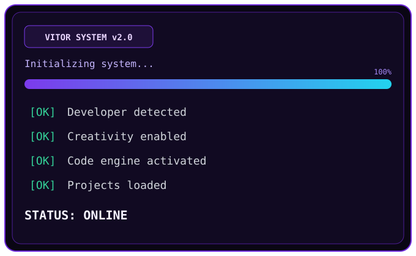

 

### VITOR AI CORE

 

**Full-Stack Developer** construindo experiências web modernas com React e Next.js.

---

### Sobre mim

Olá! Eu sou o **Vitor Kloy** — desenvolvedor full-stack focado em interfaces limpas, APIs sólidas e produtos que resolvem problemas de verdade.

Hoje atuo na **Globalpac**, e no tempo livre exploro projetos com Next.js, React e experiências de UI/UX.

- Trabalhando com apps web e sistemas internos
- Aprofundando em Next.js, TypeScript e arquitetura front-end
- Pode me perguntar sobre React, Next.js e UI moderna
- Curto transformar ideias em produtos usáveis

---

### Stack

---

### Projetos em destaque

| Projeto | Sobre |
| --- | --- |
| [Pedidos-Online-Next](https://github.com/vitorkloy/Pedidos-Online-Next) | Sistema de pedidos com Next.js |
| [controle-ponto-next](https://github.com/vitorkloy/controle-ponto-next) | Controle de ponto moderno |
| [Secure-Payments-Simulator](https://github.com/vitorkloy/Secure-Payments-Simulator) | Simulador de pagamentos seguros |
| [Farm-Frontend](https://github.com/vitorkloy/Farm-Frontend) | Frontend para gestão agrícola |
| [Climate-Monitoring](https://github.com/vitorkloy/Climate-Monitoring) | Monitoramento climático |

---

### GitHub Stats

---

*Building modern web experiences — one commit at a time.*

